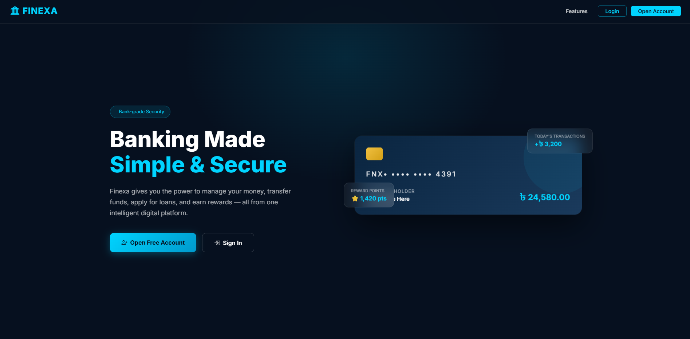
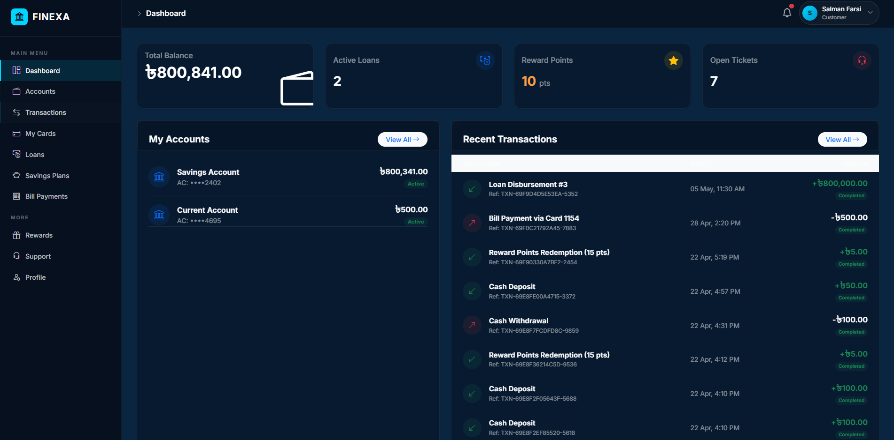
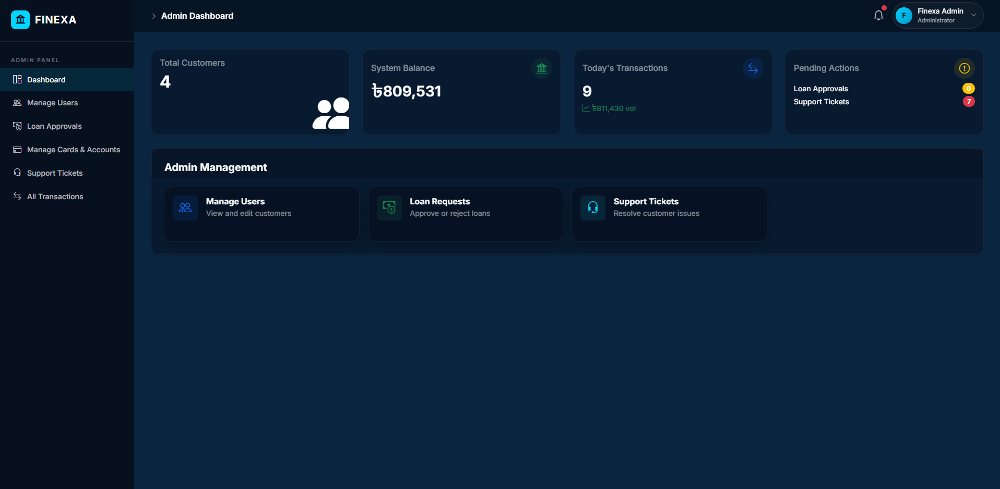

# Finexa - Secure Digital Banking Platform

Finexa is a comprehensive, modern digital banking system built with Laravel and Bootstrap. It provides a complete suite of financial services, including secure money transfers, savings accounts, loan processing, card management, bill payments, and a rewarding points system. 

It is designed with a sleek, glassmorphism-inspired dark UI to offer a premium, native app-like experience on the web.

## 📸 Screenshots

### Public Landing Page


### Customer Dashboard


### Admin Panel


## 🚀 Key Features

### 1. Account Management
* **Multi-Account Support**: Users can hold multiple accounts (Savings, Current).
* **Secure Login/Registration**: Protected by Laravel's built-in authentication and encryption.
* **Profile Management**: Update personal details and secure credentials easily.

### 2. Core Banking Operations
* **Instant Transfers**: Send funds to any Finexa account securely with real-time balance checks.
* **Deposits & Withdrawals**: Easily add funds to or withdraw from your digital wallet.
* **Transaction History**: Comprehensive, paginated history of all financial activities (credits, debits).

### 3. Advanced Financial Services
* **Card Management**: Request virtual Credit/Debit cards. Instantly freeze or unfreeze cards for security.
* **Savings Plans (DPS/FDR)**: Open fixed deposits (7.5%) or recurring deposit schemes (6.0%) and track maturity.
* **Loan Approvals**: Apply for personal or business loans. Admins review and disburse funds. Track outstanding balances and make monthly repayments.

### 4. Utility & Rewards
* **Bill Payments**: Pay utility bills from your linked cards or accounts.
* **Mobile Recharge**: Top-up mobile numbers instantly.
* **Reward Points System**: Earn points on transactions. Redeem points across multiple tiers for account cashback.

### 5. Customer Support
* **Ticketing System**: Submit support requests directly from the dashboard.
* **Admin Replies**: Real-time thread-based communication between customers and support agents.

### 6. Admin Panel
* **User Management**: Admins can suspend or activate users, or create accounts manually.
* **Global Monitoring**: View all system-wide transactions, approve/reject loans, and manage account closure requests.
* **System Metrics**: Dashboard KPIs displaying total liquidity, active loans, and transaction volumes.

## 💻 Tech Stack

* **Backend**: PHP 8.x, Laravel Framework
* **Database**: MySQL
* **Frontend**: Bootstrap 5, Vanilla CSS (Glassmorphism & Dark Mode)
* **Icons**: Bootstrap Icons
* **Fonts**: Google Fonts (Inter)

## 🛠️ Installation (Local Development)

1. **Clone the repository:**
   ```bash
   git clone https://github.com/imFARSI/digital-banking-system.git
   cd digital-banking-system
   ```

2. **Install dependencies:**
   ```bash
   composer install
   ```

3. **Configure Environment:**
   Copy `.env.example` to `.env` (or create one) and set up your local database credentials:
   ```env
   DB_CONNECTION=mysql
   DB_HOST=127.0.0.1
   DB_PORT=3306
   DB_DATABASE=finexa_db
   DB_USERNAME=root
   DB_PASSWORD=
   ```

4. **Generate Application Key:**
   ```bash
   php artisan key:generate
   ```

5. **Run Migrations & Seeders:**
   ```bash
   php artisan migrate --seed
   ```
   *(Note: Ensure your database server is running before executing)*

6. **Serve the Application:**
   ```bash
   php artisan serve
   ```
   Access the app at `http://127.0.0.1:8000`

## 🔒 Security
Finexa implements strict validation on all transaction forms, server-side balance checking, password hashing, and CSRF protection on all mutating actions to ensure a safe digital environment.

## 📄 License
This project is open-sourced under the MIT license.
